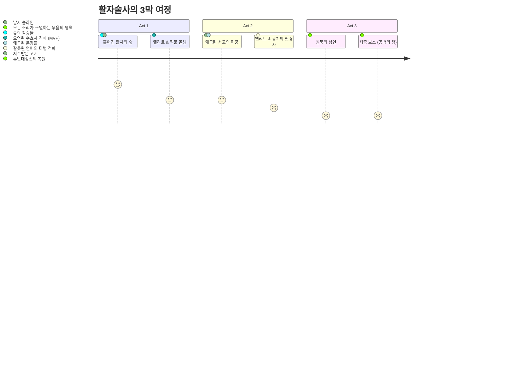
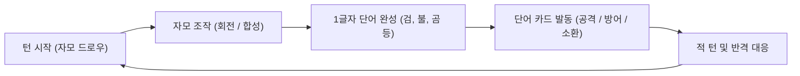
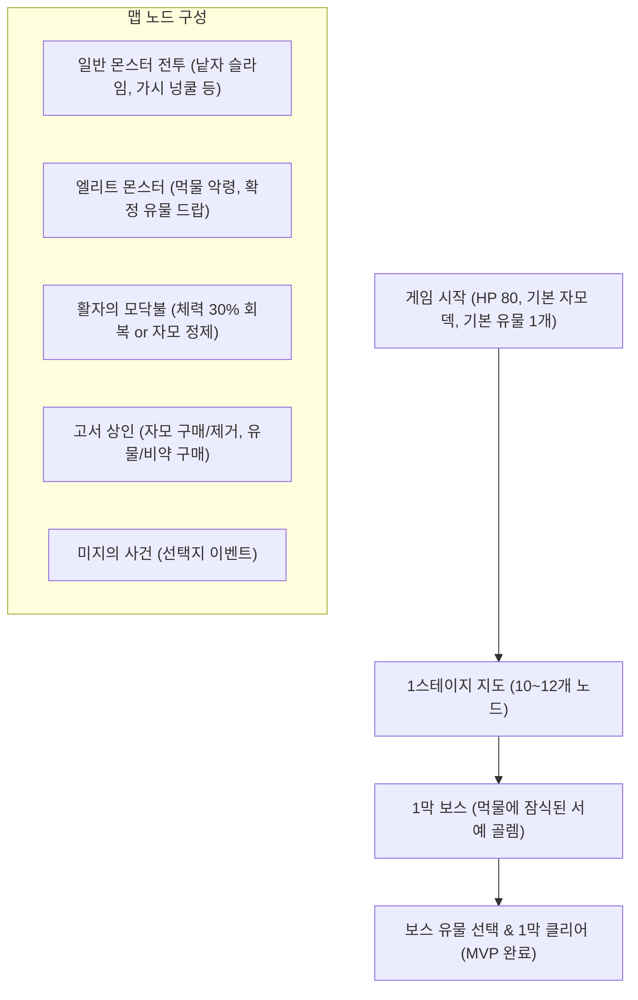

# 📜 『언어의 조각 : 말의 심연』 게임 기획 및 개발 설계서 (GDD)

---

## 1. 📌 프로젝트 개요 (Overview)

| 항목 | 내용 |
| :--- | :--- |
| **프로젝트명** | **언어의 조각 : 말의 심연** (영문: *Fragments of Language : Word Card*) |
| **장르** | 한글 자모 조합형 턴제 로그라이크 덱빌더 (Slay the Spire 스타일) |
| **타겟 플랫폼** | PC Web / Mobile (Capacitor 지원) |
| **기술 스택** | HTML5 Canvas / DOM, Modern JavaScript (ES6+), Vite, Web Audio API |
| **비주얼 스타일** | 에테르AI 32px 파스텔/레트로 픽셀 아트 스타일 (투명 배경 PNG) |
| **핵심 재미** | 손패의 자음/모음 타일을 실시간으로 회전·합성하여 1글자 단어 카드(검, 불, 곰 등)를 빚어내어 싸우는 전략적 손맛 |

---

## 2. 🌌 세계관 및 스토리 (Worldview & Narrative)

### (1) 배경 설정
태초에 만물을 정의하고 지탱하던 절대적인 원천인 **'훈민대성전(訓民大聖典)'**이 정체불명의 공백(Void) 파동으로 파괴되었습니다.
- 세상의 모든 단어가 자음과 모음(자모의 파편)으로 분해되어 흩어졌습니다.
- 이름을 잃은 사물과 생물들은 형태가 무너져 괴물이 되었고, 잘못 조합된 왜곡된 글자들(**'오자(誤字)의 군단'**)이 세계를 침식하고 있습니다.

### (2) 주인공 : 마지막 활자술사 (Word Weaver)
- 글자의 참된 본질을 기억하고 있는 유일한 계승자.
- 손끝에 닿는 자모 파편들을 공명시켜 회전·합성하고, 유효한 단어를 조합하여 현실에 실체화(현현)할 수 있는 능력을 지녔습니다.
- 부서진 성전의 심장부가 잠들어 있는 **'침묵의 탑'** 정상을 향해 나아갑니다.

### (3) 3개 액트(Act) 스테이지 구성



1. **Act 1. 흩어진 활자의 숲 (The Fractured Grove) [★ MVP 개발 범위]**
   - 글자가 부서져 생태계가 뒤틀린 고대 숲.
   - **일반 몬스터**: 낱자 슬라임, 가시 넝쿨, 사나운 멧돼지
   - **엘리트**: 먹물 웅덩이의 악령, 왜곡된 수호목
   - **보스**: **[먹물에 잠식된 서예 골렘 (Ink Golem)]**
2. **Act 2. 왜곡된 서고의 미궁 (The Twisted Archives)**
   - 문법이 붕괴되어 고서들이 날아다니고 문장이 흉기가 된 도서관.
   - **보스**: **[광기의 필경사 (The Mad Scribe)]**
3. **Act 3. 침묵의 심연 (The Void of Silence)**
   - 모든 단어와 색채가 소멸하여 흑백만 남은 무음의 영역.
   - **최종 보스**: **[공백의 군주 : 무(無)의 화신 (Lord of Void)]**

---

## 3. 🎴 핵심 전투 메커니즘 (Core Battle System)

### (1) 턴 진행 루프 (Turn Flow)
1. **턴 시작**: 플레이어는 자원(기본 3 AP)을 충전하고, 덱에서 자모 타일 5~7장을 드로우.
2. **자모 조작 및 단어 제작**:
   - **타일 회전**: `ㄱ ↔ ㄴ`, `ㅏ ↔ ㅜ ↔ ㅓ ↔ ㅗ`, `ㅣ ↔ ㅡ`
   - **타일 합성**: `ㄱ+ㄱ=ㄲ`, `ㅏ+ㅣ=ㅐ`, `ㅗ+ㅏ=ㅘ` 등
   - **단어 완성**: 조합 슬롯에 초성+중성(+종성)을 배치하면 즉시 1글자 단어 카드로 변환.
3. **단어 카드 발동**: 단어 카드를 필드로 드래그/클릭하여 효과(공격, 방어, 소환, 힐) 발동.
4. **적 턴**: 적의 머리 위에 표시된 **인텐트(행동 의도)**에 따라 공격/디버프 실행.



### (2) 1글자 단어 역할군 및 밸런스 설계

| 분류 | 대표 단어 | 조합 구조 | 전투 효과 | 에셋 키워드 |
| :--- | :--- | :--- | :--- | :--- |
| **무기 공격** | **검, 칼, 창, 활, 도, 총, 봉** | 초+중+종 (받침 有) | 기본 베기, 관통, 치명타, 방어구 파괴 | 32px 검/활/창 아이콘 |
| **원소 마법** | **불, 물, 빛, 독, 피, 뼈, 돌, 눈** | 초+중 (받침 無/有) | 화상 DoT, 정화, 실명, 중독, 흡혈, 빙결 | 32px 원소/룬/결정체 |
| **방어 회복** | **방, 갑, 옷, 투, 약, 문, 벽, 성** | 다양함 | 쉴드 생성, 피해 경감, HP 회복, 1회 무적 | 32px 방패/갑옷/물약/성벽 |
| **생물 소환** | **곰, 뱀, 새, 용, 쥐, 개, 풀, 꽃** | 다양함 | 아군 전열 소환수 배치 (탱킹/도발/중독/수면) | 32px 몬스터/동물 스프라이트 |

> **💡 난이도 밸런싱 규칙**:
> - **받침 없는 단어 (`불, 비, 피, 소, 초`)**: 2장으로 빠른 조합 가능, 균형 잡힌 기본 효과.
> - **받침 있는 단어 (`검, 곰, 뱀, 벽, 덫`)**: 3장의 자모를 소모하므로 강력한 피해량 및 복합 부가 효과 부여.

---

## 4. 👑 유물 (Relic) 시스템 설계

### (1) 한글 음운/형태 규칙 유물 (고유 기믹)
- **종성의 무게추**: 받침(종성)이 들어간 단어 발동 시 **추가 피해 +5**.
- **거센소리 부싯돌**: 거센소리(`ㅋ, ㅌ, ㅍ, ㅊ`) 단어 사용 시 100% 치명타 (피해량 1.5배).
- **울림소리 방울**: 울림소리(`ㄴ, ㄹ, ㅁ, ㅇ`) 받침 단어 발동 시 **HP 2 회복**.
- **된소리의 벼루**: 손패에 동일 자음 2장 존재 시 무료로 **된소리(`ㄲ, ㄸ, ㅃ, ㅆ, ㅉ`)로 자동 합성**.

### (2) 단어 테마 시너지 유물 (덱 빌딩)
- **명장의 숫돌**: 무기 단어(`검, 칼, 창, 활, 도`) 사용 시 피해량 +3 및 방어도 2 획득.
- **연금술사의 도가니**: 원소/마법 단어(`불, 물, 독, 약`) 발동 시 효과 1.5배 증폭 및 '독' 1스택 추가.
- **수호자의 인장**: 구조물 단어(`문, 벽, 성`)로 얻은 방어도가 다음 턴에 50% 이월.
- **야수 조련용 피리**: 생물 단어(`곰, 뱀, 새, 용`) 소환 시 소환수 최대 체력 +8 및 첫 턴 도발.

### (3) 자모 조작 & 드로우 유물
- **훈민정음 돋보기**: 매 턴 시작 시 **모음 타일 1장 확정 추가 드로우**.
- **자벌레 나침반**: 매 턴 첫 번째 타일 **회전 비용이 0 (무료)**.
- **먹물 묻은 붓**: 매 턴 첫 번째로 완성한 단어 카드의 자모 1장을 손패로 반환.
- **조커 활자판 (보스 유물)**: 매 전투 시작 시 어떤 자모로든 결합 가능한 **'무지개 조커 타일' 1장** 지급.

---

## 5. 🎨 에셋 관리 및 디렉토리 구조

- **규격**: 32x32 베이스 픽셀 아트 (에테르AI 스타일 통일)
- **저장 경로**: `E:\project\word_card\assets\`
- **메타데이터**: `assets\word_assets_manifest.json` 에 37개 단어 총 139개 에셋 인덱싱 완료

```text
E:\project\word_card\assets\
├── 01_무기_공격/ (sword_검, dagger_칼, spear_창, bow_활, gun_총, axe_mace_도, staff_봉)
├── 02_방어_장비/ (shield_방, armor_갑, cloth_옷, helmet_투, rope_끈, net_망, drum_북, bell_종)
├── 03_원소_마법/ (fire_불, water_물, light_빛, poison_독, potion_약, blood_피, bone_뼈, stone_돌, snow_ice_눈)
├── 04_생물_소환/ (bear_곰, snake_뱀, bird_새, dragon_용, rat_쥐, dog_wolf_개, herb_plant_풀, flower_꽃)
├── 05_구조_필드/ (door_문, wall_벽, castle_성, cave_굴, trap_덫)
└── word_assets_manifest.json
```

---

## 6. 🗺️ MVP 1스테이지 (Act 1) 스펙



---

## 7. 🏗️ 기술 아키텍처 및 모듈 구조

```text
E:\project\word_card\
├── index.html                   # 메인 캔버스 및 뷰포트
├── package.json                 # Vite 번들러 및 스크립트 설정
├── GAME_DESIGN.md               # 본 게임 기획 및 설계 문서
├── src\
│   ├── css\
│   │   ├── main.css             # 기본 스타일 및 레트로 픽셀 테마
│   │   ├── battle.css           # 전장, 적 체력바, 인텐트 표시
│   │   └── card.css             # 자모 타일, 조합 슬롯, 완성 카드 UI
│   └── js\
│       ├── core\
│       │   ├── hangulEngine.js   # 자모 분해, 조합, 회전, 결합 핵심 엔진
│       │   └── wordDatabase.js   # 1글자 단어 스펙(데미지, 효과, 에셋 매핑)
│       ├── battle\
│       │   ├── battleManager.js  # 턴 라이프사이클, 데미지 계산, 승패 판정
│       │   ├── cardSystem.js     # 자모 덱/드로우/핸드/조합 슬롯 관리
│       │   ├── enemyAI.js        # 몬스터 스킬 패턴 및 인텐트 예고
│       │   └── relicSystem.js    # 유물 패시브 및 트리거 이벤트
│       ├── map\
│       │   └── mapManager.js     # 슬더스식 노드 맵 생성 및 이동
│       ├── ui\
│       │   ├── renderBattle.js   # 전장, 이펙트, 체력바 렌더링
│       │   └── renderHand.js     # 자모 타일 드래그&드롭, 회전 인터랙션
│       └── app.js                # 메인 게임 인스턴스 초기화
└── assets\                      # 32px 픽셀아트 에셋 및 manifest.json
```

---

## 8. 🗓️ 단계별 개발 로드맵 (Milestones)

- [x] **[Milestone 0] 기획 수립 및 기본 에셋 카탈로그 구축** (완료)
- [ ] **[Milestone 1] 기본 프로젝트 셋업 & 자모 조합 인터랙션 프로토타입**
  - Vite 환경 설정 및 기존 `hangulEngine` 이식
  - 손패 자모 타일 드로우, 회전/합성, 조합 슬롯에서 1글자 단어 카드로 변환되는 인터랙션 구현
- [ ] **[Milestone 2] 1:1 턴제 전투 시스템 & 적 인텐트 구현**
  - 적 체력/인텐트 표시, 단어 카드 발동 시 공격/방어/상태이상 적용 및 수치 연출
- [ ] **[Milestone 3] 유물 시스템 & 보상 루프 연동**
  - 유물 효과 트리거 연동, 전투 승리 보상(자모 선택, 골드, 유물)
- [ ] **[Milestone 4] 1스테이지 노드 맵 & 보스전 (MVP 완성)**
  - 슬더스 스타일 맵 탐험(전투, 모닥불, 상점, 이벤트) 및 1막 보스전 구현
- [ ] **[Milestone 5] 폴리싱 & 이펙트/사운드 강화**
